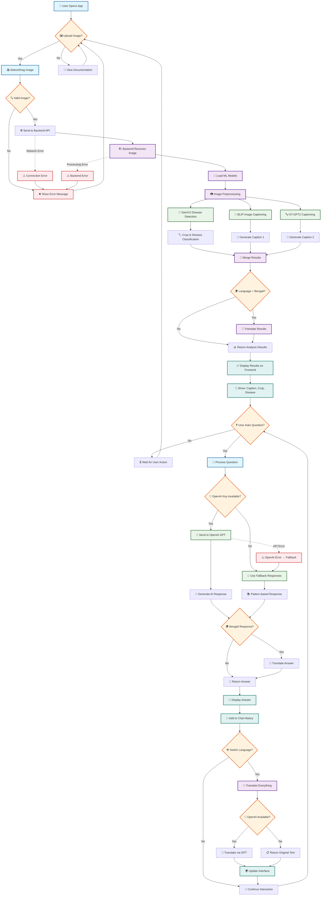
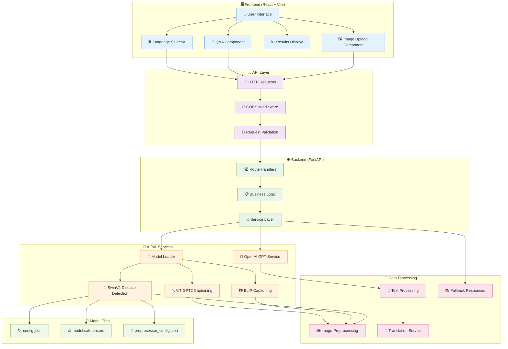
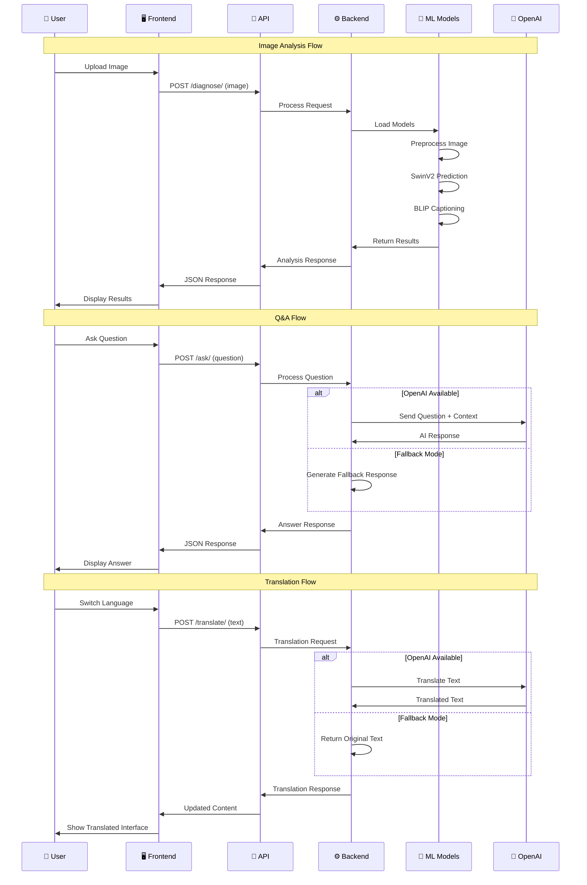

# 🌱 Crop Disease Detection Assistant - System Flowchart

## 📊 Complete System Flow Diagram

```mermaid
flowchart TD
    %% User Interface Layer
    A[👤 User Opens App] --> B{🖼️ Upload Image?}

    %% Image Upload Flow
    B -->|Yes| C[📤 Select/Drag Image]
    B -->|No| D[📖 View Documentation]

    C --> E{🔍 Valid Image?}
    E -->|No| F[❌ Show Error Message]
    E -->|Yes| G[🌐 Send to Backend API]

    %% Backend Processing
    G --> H[🏗️ Backend Receives Image]
    H --> I[🤖 Load ML Models]

    %% Model Processing
    I --> J[📷 Image Preprocessing]
    J --> K[🧠 SwinV2 Disease Detection]
    J --> L[💬 BLIP Image Captioning]
    J --> M[🔤 ViT-GPT2 Captioning]

    %% Results Processing
    K --> N[🏷️ Crop & Disease Classification]
    L --> O[📝 Generate Caption 1]
    M --> P[📝 Generate Caption 2]

    N --> Q[🔄 Merge Results]
    O --> Q
    P --> Q

    Q --> R{🌍 Language = Bengali?}
    R -->|Yes| S[🔄 Translate Results]
    R -->|No| T[📊 Return Analysis Results]
    S --> T

    %% Frontend Display
    T --> U[✅ Display Results on Frontend]
    U --> V[📱 Show: Caption, Crop, Disease]

    %% Q&A Flow
    V --> W{❓ User Asks Question?}
    W -->|No| X[⏳ Wait for User Action]
    W -->|Yes| Y[💭 Process Question]

    Y --> Z{🔑 OpenAI Key Available?}
    Z -->|Yes| AA[🧠 Send to OpenAI GPT]
    Z -->|No| BB[🔧 Use Fallback Responses]

    AA --> CC[🤖 Generate AI Response]
    BB --> DD[📚 Pattern-based Response]

    CC --> EE{🌍 Bengali Response?}
    DD --> EE
    EE -->|Yes| FF[🔄 Translate Answer]
    EE -->|No| GG[📝 Return Answer]
    FF --> GG

    GG --> HH[💬 Display Answer]
    HH --> II[📝 Add to Chat History]

    %% Language Switching
    II --> JJ{🌐 Switch Language?}
    JJ -->|Yes| KK[🔄 Translate Everything]
    JJ -->|No| LL[🔄 Continue Interaction]

    KK --> MM{🔑 OpenAI Available?}
    MM -->|Yes| NN[🤖 Translate via GPT]
    MM -->|No| OO[📋 Return Original Text]

    NN --> PP[🌍 Update Interface]
    OO --> PP
    PP --> LL

    %% Loop Back
    LL --> W
    X --> B
    F --> B
    D --> B

    %% Error Handling
    G -.->|Network Error| QQ[⚠️ Connection Error]
    H -.->|Processing Error| RR[⚠️ Backend Error]
    AA -.->|API Error| SS[⚠️ OpenAI Error → Fallback]

    QQ --> F
    RR --> F
    SS --> BB

    %% Styling
    classDef userAction fill:#e1f5fe,stroke:#01579b,stroke-width:2px
    classDef processing fill:#f3e5f5,stroke:#4a148c,stroke-width:2px
    classDef aiModel fill:#e8f5e8,stroke:#1b5e20,stroke-width:2px
    classDef decision fill:#fff3e0,stroke:#e65100,stroke-width:2px
    classDef error fill:#ffebee,stroke:#c62828,stroke-width:2px
    classDef success fill:#e0f2f1,stroke:#00695c,stroke-width:2px

    class A,C,Y userAction
    class H,I,J,Q,S,KK processing
    class K,L,M,AA,BB aiModel
    class B,E,R,W,Z,EE,JJ,MM decision
    class F,QQ,RR,SS error
    class U,V,HH,II,PP success
```

## 🏗️ System Architecture Flow

```mermaid
graph TB
    subgraph "🖥️ Frontend (React + Vite)"
        A1[📱 User Interface]
        A2[🖼️ Image Upload Component]
        A3[💬 Q&A Component]
        A4[📊 Results Display]
        A5[🌐 Language Selector]
    end

    subgraph "🔌 API Layer"
        B1[📡 HTTP Requests]
        B2[🔄 CORS Middleware]
        B3[📝 Request Validation]
    end

    subgraph "⚙️ Backend (FastAPI)"
        C1[🛣️ Route Handlers]
        C2[📋 Business Logic]
        C3[🔧 Service Layer]
    end

    subgraph "🧠 AI/ML Services"
        D1[🤖 Model Loader]
        D2[🌾 SwinV2 Disease Detection]
        D3[📷 BLIP Captioning]
        D4[🔤 ViT-GPT2 Captioning]
        D5[🧠 OpenAI GPT Service]
    end

    subgraph "💾 Data Processing"
        E1[🖼️ Image Preprocessing]
        E2[📝 Text Processing]
        E3[🔄 Translation Service]
        E4[📚 Fallback Responses]
    end

    subgraph "📁 Model Files"
        F1[🏷️ config.json]
        F2[⚖️ model.safetensors]
        F3[🔧 preprocessor_config.json]
    end

    %% Connections
    A1 --> A2
    A1 --> A3
    A1 --> A4
    A1 --> A5

    A2 --> B1
    A3 --> B1
    A5 --> B1

    B1 --> B2
    B2 --> B3
    B3 --> C1

    C1 --> C2
    C2 --> C3

    C3 --> D1
    C3 --> D5

    D1 --> D2
    D1 --> D3
    D1 --> D4

    D2 --> E1
    D3 --> E1
    D4 --> E1
    D5 --> E2

    E2 --> E3
    C3 --> E4

    D2 --> F1
    D2 --> F2
    D2 --> F3

    %% Styling
    classDef frontend fill:#e3f2fd,stroke:#1976d2
    classDef api fill:#f3e5f5,stroke:#7b1fa2
    classDef backend fill:#e8f5e8,stroke:#388e3c
    classDef ai fill:#fff3e0,stroke:#f57c00
    classDef data fill:#fce4ec,stroke:#c2185b
    classDef files fill:#f1f8e9,stroke:#689f38

    class A1,A2,A3,A4,A5 frontend
    class B1,B2,B3 api
    class C1,C2,C3 backend
    class D1,D2,D3,D4,D5 ai
    class E1,E2,E3,E4 data
    class F1,F2,F3 files
```

## 🔄 Data Flow Sequence

```mermaid
sequenceDiagram
    participant U as 👤 User
    participant FE as 🖥️ Frontend
    participant API as 🔌 API
    participant BE as ⚙️ Backend
    participant ML as 🧠 ML Models
    participant GPT as 🤖 OpenAI

    Note over U,GPT: Image Analysis Flow

    U->>FE: Upload Image
    FE->>API: POST /diagnose/ (image)
    API->>BE: Process Request
    BE->>ML: Load Models
    ML->>ML: Preprocess Image
    ML->>ML: SwinV2 Prediction
    ML->>ML: BLIP Captioning
    ML->>BE: Return Results
    BE->>API: Analysis Response
    API->>FE: JSON Response
    FE->>U: Display Results

    Note over U,GPT: Q&A Flow

    U->>FE: Ask Question
    FE->>API: POST /ask/ (question)
    API->>BE: Process Question

    alt OpenAI Available
        BE->>GPT: Send Question + Context
        GPT->>BE: AI Response
    else Fallback Mode
        BE->>BE: Generate Fallback Response
    end

    BE->>API: Answer Response
    API->>FE: JSON Response
    FE->>U: Display Answer

    Note over U,GPT: Translation Flow

    U->>FE: Switch Language
    FE->>API: POST /translate/ (text)
    API->>BE: Translation Request

    alt OpenAI Available
        BE->>GPT: Translate Text
        GPT->>BE: Translated Text
    else Fallback Mode
        BE->>BE: Return Original Text
    end

    BE->>API: Translation Response
    API->>FE: Updated Content
    FE->>U: Show Translated Interface
```
